# INT3RCEPTOR UI Realignment Plan

**Status**: Planning Phase  
**Priority**: P0 (Critical) - P3 (Low)  
**Last Updated**: 2025-01-26  
**Estimated Phases**: 12

---

## Executive Summary

The INT3RCEPTOR project has a solid functional architecture, but the user interface has deviated from the approved design mockups. This plan outlines a comprehensive realignment of the UI to match the approved designs while maintaining 100% of existing functionality.

**Key Objectives:**
- Align all 10+ views with approved mockups
- Improve visual consistency across the application
- Enhance accessibility (WCAG AA minimum)
- Maintain all existing functionality
- Zero impact on backend architecture

---

## Architecture Overview

### Current State Analysis

```mermaid
graph TD
    A[INT3RCEPTOR UI] --> B[Dashboard]
    A --> C[Traffic Tab]
    A --> D[Intruder Tab]
    A --> E[Repeater Tab]
    A --> F[Scanner Tab]
    A --> G[Plugins Tab]
    A --> H[Decoder Tab]
    A --> I[Comparer Tab]
    A --> J[Settings Panel]
    A --> K[WebSocket Tab]
    
    B --> B1[Basic Layout]
    B --> B2[Missing Feature Cards]
    B --> B3[Generic Activity Log]
    
    C --> C1[Single Column]
    C --> C2[Basic Filters]
    C --> C3[Simple Details Panel]
    
    D --> D1[Good Structure]
    D --> D2[Needs Visual Polish]
    D --> D3[Missing Tooltips]
    
    E --> E1[Vertical Layout]
    E --> E2[No Response Tabs]
    E --> E3[Basic Styling]
    
    F --> F1[Generic Empty State]
    F --> F2[List-Based Findings]
    F --> F3[Basic Stats]
    
    G --> G1[Simple List]
    G --> G2[No Marketplace]
    G --> G3[Basic State]
    
    H --> H1[Basic Layout]
    H --> H2[No Copy Buttons]
    H --> H3[Simple Codec]
    
    I --> I1[Two Textareas]
    I --> I2[Basic Diff]
    I --> I3[No Line Numbers]
    
    J --> J1[Functional]
    J --> J2[Inconsistent Visuals]
    J --> J3[Missing Organization]
    
    K --> K1[Simple Timeline]
    K --> K2[No Stats Panel]
    K --> K3[Basic Frame List]
```

### Target State Architecture

```mermaid
graph TD
    A[INT3RCEPTOR UI] --> B[Shared Components]
    A --> C[Design Tokens]
    A --> D[Layout System]
    
    B --> B1[FeatureCard]
    B --> B2[MetricCard]
    B --> B3[StatusBadge]
    B --> B4[ProgressRing]
    B --> B5[TwoColumnLayout]
    B --> B6[SplitView]
    
    C --> C1[Colors]
    C --> C2[Typography]
    C --> C3[Spacing]
    C --> C4[Shadows]
    C --> C5[Animations]
    
    D --> D1[Grid System]
    D --> D2[Flex Patterns]
    D --> D3[Responsive Breakpoints]
    
    A --> E[Views]
    E --> E1[Dashboard]
    E --> E2[Traffic]
    E --> E3[Intruder]
    E --> E4[Repeater]
    E --> E5[Scanner]
    E --> E6[Plugins]
    E --> E7[Decoder]
    E --> E8[Comparer]
    E --> E9[Settings]
    E --> E10[WebSocket]
```

---

## Phase-by-Phase Implementation

### PHASE 0: Foundation & Setup

**Goal**: Establish reusable components and design system

**Tasks**:
1. Create shared UI components library
2. Establish design tokens in CSS variables
3. Create reusable layout components
4. Set up icon system
5. Review tailwind.config.js

**Deliverables**:
- `/int3rceptor/desktop/src/components/shared/` directory structure
- `/int3rceptor/desktop/src/styles/tokens.css` with all design tokens
- Updated `/int3rceptor/desktop/tailwind.config.js`

**Design Tokens Reference**:

```css
:root {
  /* Colors */
  --color-bg-primary: #0a0a0f;
  --color-bg-secondary: #1a1a2e;
  --color-bg-panel: #2a2a3e;
  --color-accent-cyan: #00d4ff;
  --color-accent-magenta: #ff006e;
  --color-accent-orange: #ffb800;
  --color-accent-purple: #8b5cf6;
  --color-text-primary: #ffffff;
  --color-text-secondary: #a0a0a0;
  --color-text-muted: #606060;
  --color-border-default: #2a2a3e;
  
  /* Typography */
  --font-mono: 'Fira Code', 'JetBrains Mono', monospace;
  --font-sans: 'Inter', 'Segoe UI', sans-serif;
  --font-heading: 'Orbitron', 'Rajdhani', sans-serif;
  
  /* Spacing */
  --spacing-xs: 4px;
  --spacing-sm: 8px;
  --spacing-md: 16px;
  --spacing-lg: 20px;
  --spacing-xl: 24px;
  
  /* Shadows */
  --shadow-sm: 0 1px 2px rgba(0, 0, 0, 0.05);
  --shadow-md: 0 4px 6px rgba(0, 0, 0, 0.1);
  --shadow-lg: 0 10px 15px rgba(0, 0, 0, 0.2);
  --shadow-cyan: 0 0 20px rgba(0, 212, 255, 0.15);
  --shadow-magenta: 0 0 20px rgba(255, 0, 110, 0.15);
  
  /* Transitions */
  --transition-fast: 150ms cubic-bezier(0.4, 0, 0.2, 1);
  --transition-normal: 300ms cubic-bezier(0.4, 0, 0.2, 1);
  --transition-slow: 500ms cubic-bezier(0.4, 0, 0.2, 1);
}
```

---

### PHASE 1: Dashboard (P0 - Critical)

**Current Issues**:
- ❌ Missing feature cards with iconography
- ❌ Recent Requests is generic placeholder
- ❌ Activity Log lacks visual differentiation
- ❌ No metric cards with trends

**Target State**:

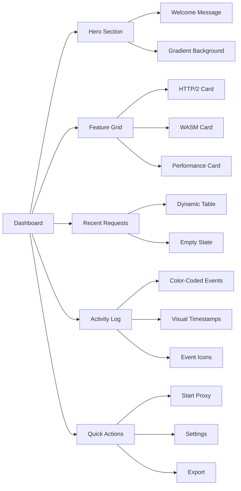

**Implementation Details**:

1. **Hero Section**
   - Clear welcome message with gradient background
   - Use `--color-accent-cyan` for primary text
   - Add subtle hexagon pattern overlay

2. **Feature Cards Grid**
   - 3-column responsive grid
   - Each card: Icon + Title + Description
   - Hover effects with border color change
   - Icons: ⚡ (HTTP/2), 🔌 (WASM), 🚀 (Performance)

3. **Recent Requests**
   - Dynamic data from API
   - Elegant empty state with illustration
   - Status code badges with color coding
   - Hover states with left border highlight

4. **Activity Log**
   - Color-coded events by level (info, warning, error)
   - Visual timestamps in secondary text
   - Event icons for quick scanning
   - Expandable details for complex events

5. **Quick Actions**
   - Primary button: Start Proxy (hexagonal shape)
   - Secondary buttons: Settings, Export
   - Consistent spacing and alignment

---

### PHASE 2: Traffic Tab (P0 - Critical)

**Current Issues**:
- ❌ Single column layout
- ❌ Basic filters
- ❌ Simple details panel

**Target State**:

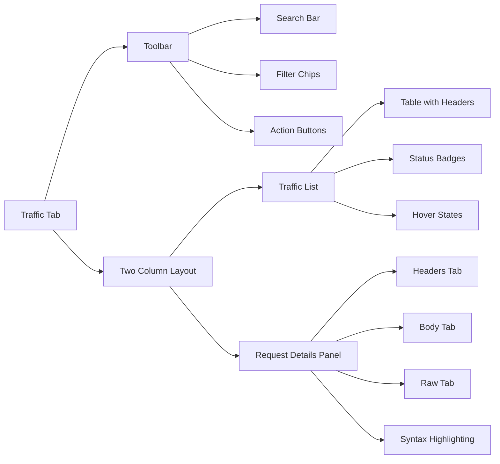

**Implementation Details**:

1. **Two-Column Layout**
   - Left: Traffic list (flex-1)
   - Right: Request details (w-1/3, 400px min)
   - Collapsible details panel

2. **Filter Chips**
   - GET (cyan), POST (magenta), PUT (orange), DELETE (red)
   - Pill-shaped with active state styling
   - Clear all filters button

3. **Request Details Panel**
   - Tabbed interface: Headers | Body | Raw
   - Syntax highlighting for JSON/XML/HTML
   - Copy-to-clipboard buttons
   - Expandable/collapsible sections

4. **Table Enhancements**
   - Sticky header
   - Hover state with cyan left border
   - Selected state with darker background
   - Status code badges with color coding

---

### PHASE 3: Intruder Tab (P0 - Critical)

**Current Issues**:
- ❌ Missing tooltips for attack types
- ❌ Basic payload textarea
- ❌ Simple results table

**Target State**:

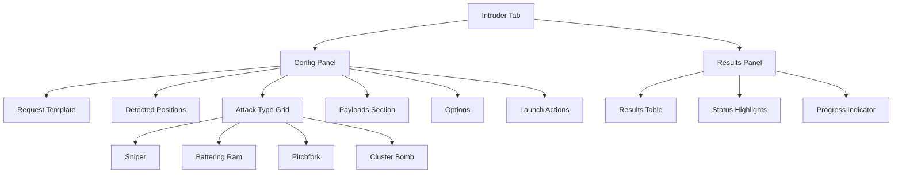

**Implementation Details**:

1. **Numbered Sections**
   - Clear visual hierarchy: 1. Request Template → 5. Options
   - Each section with distinct background
   - Progress indicator showing current step

2. **Attack Type Grid**
   - 2x2 grid layout
   - Each card: Icon + Name + Description
   - Hover effects with tooltip
   - Active state with cyan border

3. **Payloads Section**
   - Multiline textarea with line numbers
   - "Load Common" button with dropdown
   - Payload count display
   - Clear button

4. **Results Table**
   - Highlighted status codes (anomalies)
   - Interesting responses with magenta left border
   - Color-coded by status range
   - Sortable columns

---

### PHASE 4: Repeater Tab (P1 - High)

**Current Issues**:
- ❌ Vertical layout
- ❌ No response tabs
- ❌ Basic styling

**Target State**:

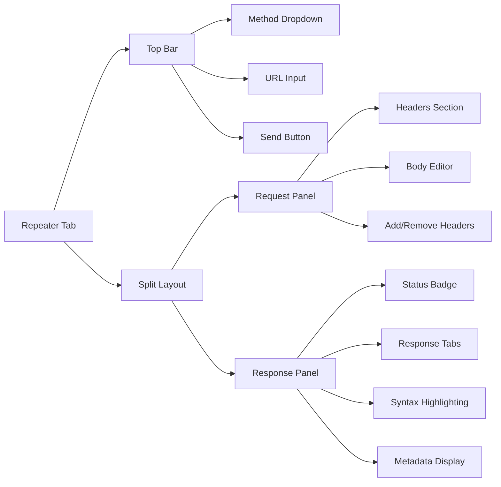

**Implementation Details**:

1. **Horizontal Split Layout**
   - 50/50 split between Request and Response
   - Draggable divider
   - Responsive: stack on mobile

2. **Request Panel**
   - Method dropdown (cyan when open)
   - URL input with full width
   - Collapsible Headers section
   - Add/Remove header buttons
   - Body editor with syntax highlighting

3. **Response Panel**
   - Prominent status code badge (top right)
   - Tabs: Raw | Formatted
   - Syntax highlighting for JSON/XML/HTML
   - Metadata: Time, Size, Headers count
   - Copy-to-clipboard button

4. **Send Button**
   - Hexagonal shape
   - Cyan background with glow effect
   - Loading state with spinner
   - Disabled state styling

---

### PHASE 5: Scanner Tab (P1 - High)

**Current Issues**:
- ❌ Generic empty state
- ❌ List-based findings
- ❌ Basic stats

**Target State**:

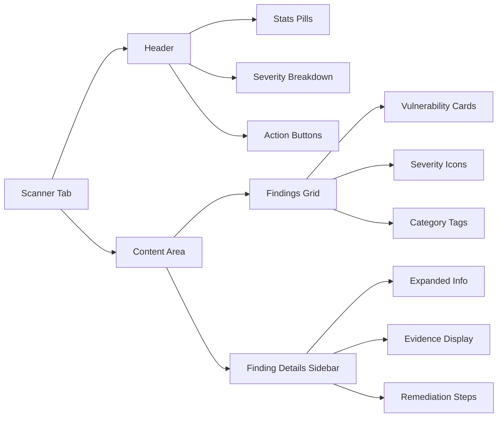

**Implementation Details**:

1. **Elegant Empty State**
   - Clear message: "Start a scan to detect security issues"
   - Illustration or icon
   - Call-to-action button
   - Helpful tips

2. **Card-Based Findings**
   - Grid layout (2-3 columns)
   - Each card: Severity icon + Title + URL + Category
   - Hover effects with border highlight
   - Click to view details

3. **Finding Details Sidebar**
   - Expanded information panel
   - Evidence display with syntax highlighting
   - Remediation steps
   - References links
   - Severity distribution chart

4. **Stats Pills**
   - Scanned count
   - Findings count
   - Severity breakdown (Critical, High, Medium, Low, Info)
   - Color-coded badges

---

### PHASE 6: Settings Panel (P1 - High)

**Current Issues**:
- ❌ Inconsistent visuals
- ❌ Missing organization
- ❌ Basic toggles

**Target State**:

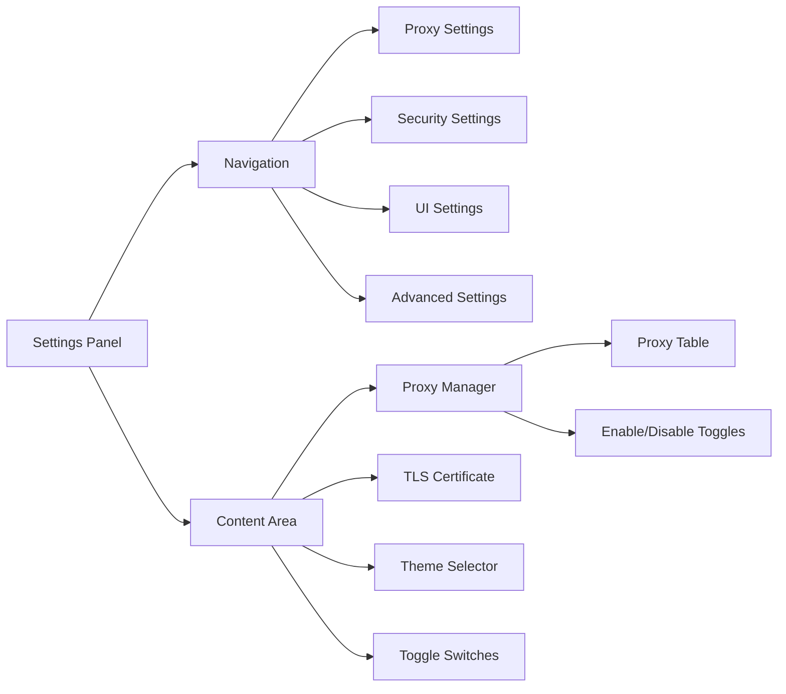

**Implementation Details**:

1. **Organized Layout**
   - Left navigation (tabs)
   - Center content area
   - Right details panel (optional)
   - Clear section separation

2. **Proxy Manager**
   - Table of configured proxies
   - Enable/Disable toggles
   - Add/Edit/Delete buttons
   - Status indicators

3. **Improved Toggles**
   - Smooth animations
   - Clear visual feedback
   - Accessible (keyboard navigation)
   - Consistent sizing

4. **Action Buttons**
   - SAVE button (primary, cyan)
   - Reset Defaults button (secondary)
   - Proper spacing and alignment

---

### PHASE 7: Plugins Tab (P2 - Medium)

**Current Issues**:
- ❌ Simple list
- ❌ No marketplace
- ❌ Basic state

**Target State**:

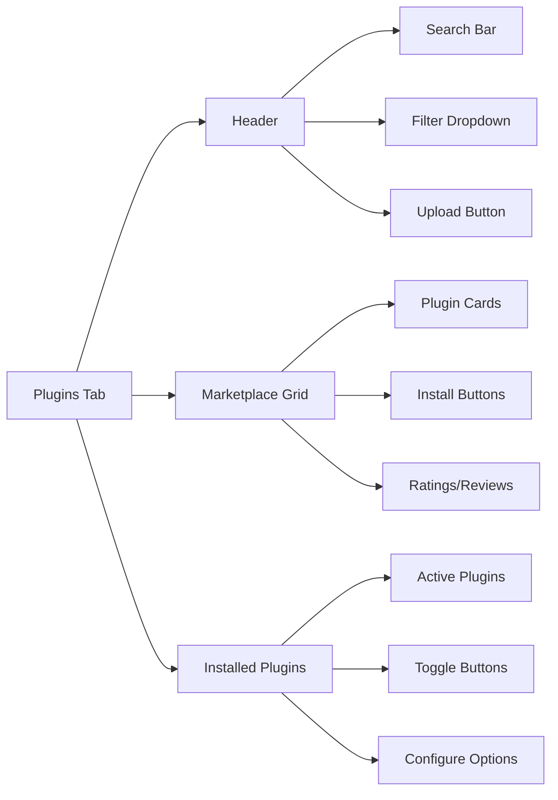

**Implementation Details**:

1. **Marketplace Grid**
   - Grid layout (3-4 columns)
   - Each card: Icon + Name + Description + Install Button
   - Search and filter functionality
   - Rating/review display

2. **Plugin Cards**
   - Clear visual hierarchy
   - Install/Uninstall buttons
   - Version display
   - Category tags
   - Hover effects

3. **Installed Plugins Section**
   - Separate from marketplace
   - Toggle enable/disable
   - Configure options button
   - Reload button

---

### PHASE 8: Decoder Tab (P2 - Medium)

**Current Issues**:
- ❌ Basic layout
- ❌ No copy buttons
- ❌ Simple codec selector

**Target State**:

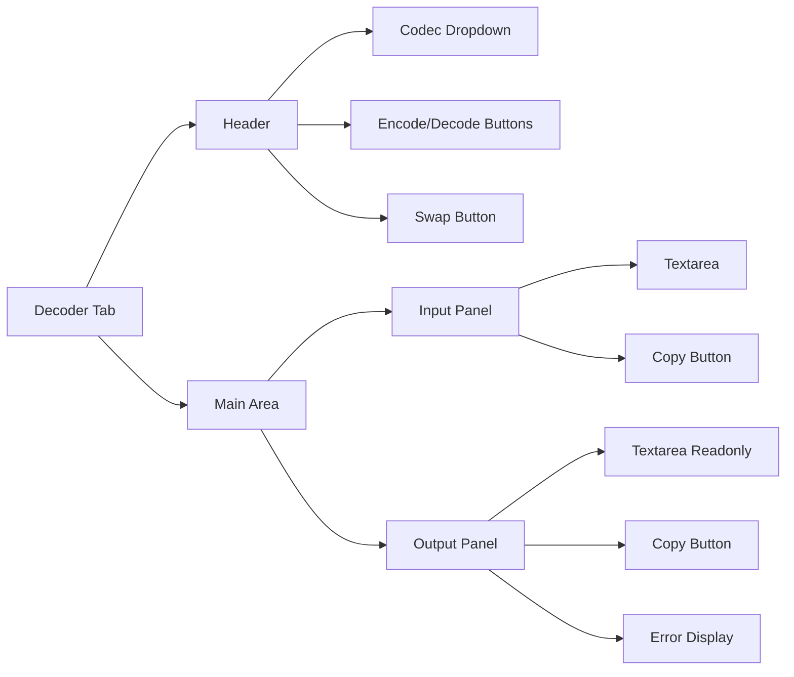

**Implementation Details**:

1. **Codec Selector**
   - Dropdown with all encoding types
   - Base64, URL, Hex, HTML, Rot13, etc.
   - Clear selection indicator

2. **Encode/Decode Buttons**
   - Toggle buttons with active state
   - Cyan background when active
   - Smooth transitions

3. **Copy-to-Clipboard**
   - Buttons for both input and output
   - Visual feedback on click
   - Tooltip: "Copied!"

4. **Error Display**
   - Clear error messages
   - Red border on output
   - Helpful suggestions

5. **Swap Button**
   - Animation on click
   - Swaps input/output and operation
   - Visual feedback

---

### PHASE 9: Comparer Tab (P2 - Medium)

**Current Issues**:
- ❌ Basic two textareas
- ❌ Simple diff
- ❌ No line numbers

**Target State**:

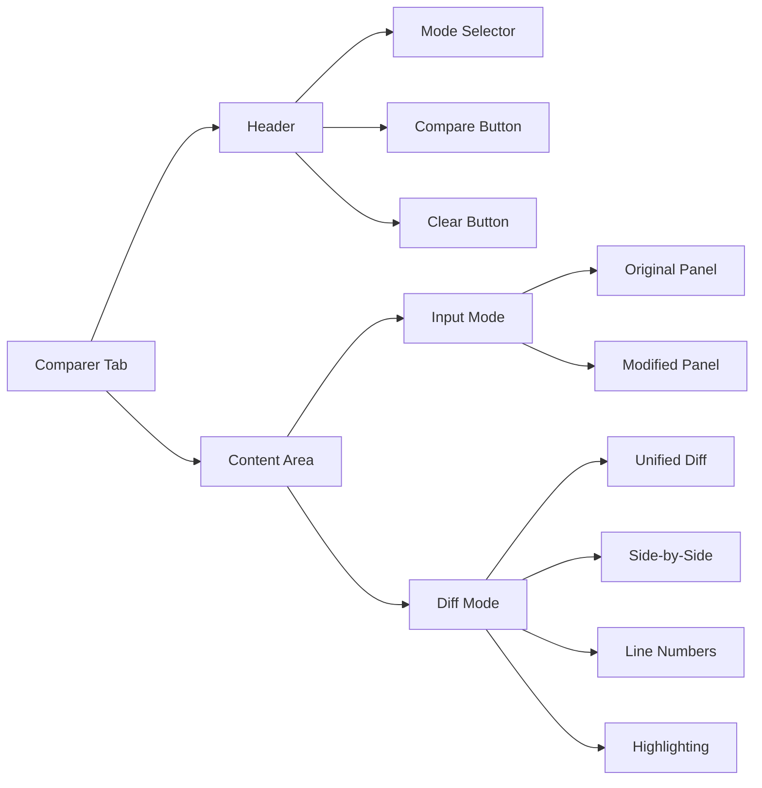

**Implementation Details**:

1. **Two-Column Layout**
   - Left: Original
   - Right: Modified
   - Descriptive headers
   - Equal width

2. **Diff Highlighting**
   - Green for additions
   - Red for deletions
   - Gray for unchanged
   - High contrast

3. **Mode Selector**
   - Lines (default)
   - Words
   - Characters
   - Dropdown with clear selection

4. **Line Numbers**
   - Line numbers for both panels
   - Synchronized scrolling
   - Click to copy line

5. **View Toggle**
   - Unified diff
   - Side-by-side diff
   - Smooth transition

6. **Export Diff**
   - Copy to clipboard
   - Download as file
   - Share link (optional)

---

### PHASE 10: WebSocket Tab (P3 - Low)

**Current Issues**:
- ❌ Simple timeline
- ❌ No stats panel
- ❌ Basic frame list

**Target State**:

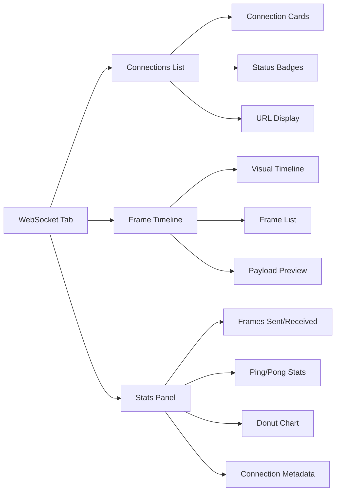

**Implementation Details**:
1. **Visual Timeline**
   - Timeline of events
   - Client→Server (cyan arrow)
   - Server→Client (magenta arrow)
   - Timestamp display

2. **Frame List**
   - Table with columns: Timestamp, Direction, Type, Payload, Size
   - Color-coded by direction
   - Hover effects
   - Click to expand

3. **Stats Panel**
   - Frames Sent/Received counters
   - Ping/Pong stats
   - Donut chart: Text vs Binary
   - Connection metadata (duration, URL, etc.)

4. **Donut Chart**
   - Visual distribution of frame types
   - Interactive segments
   - Legend with colors
   - Hover tooltips

---

## Global Design Principles

### Color Scheme

| Purpose | Color | Hex | Usage |
|---------|-------|-----|-------|
| Primary Accent | Cyan | `#00d4ff` | Links, active states, primary buttons |
| Secondary Accent | Magenta | `#ff006e` | Highlights, warnings, secondary buttons |
| Tertiary Accent | Orange | `#ffb800` | Warnings, stats, tertiary elements |
| Quaternary Accent | Purple | `#8b5cf6` | Gradients, subtle accents |
| Background Primary | Dark | `#0a0a0f` | Main background |
| Background Secondary | Alt | `#1a1a2e` | Panels, secondary areas |
| Background Panel | Panel | `#2a2a3e` | Tertiary areas |
| Text Primary | White | `#ffffff` | Main text |
| Text Secondary | Gray | `#a0a0a0` | Secondary text, labels |
| Text Muted | Dark Gray | `#606060` | Disabled, placeholders |

### Typography

| Element | Font | Size | Weight |
|----------|-------|------|--------|
| H1 | Orbitron | 2rem | Bold |
| H2 | Orbitron | 1.5rem | Bold |
| H3 | Orbitron | 1.25rem | Bold |
| Body | Inter | 0.875rem | Normal |
| Code | Fira Code | 0.875rem | Normal |
| Labels | Inter | 0.75rem | Medium |

### Spacing

| Name | Value | Usage |
|------|-------|-------|
| xs | 4px | Tight spacing |
| sm | 8px | Default spacing |
| md | 16px | Section spacing |
| lg | 20px | Component spacing |
| xl | 24px | Large spacing |

### Shadows

| Name | Value | Usage |
|------|-------|-------|
| sm | `0 1px 2px rgba(0, 0, 0, 0.05)` | Small elements |
| md | `0 4px 6px rgba(0, 0, 0, 0.1)` | Cards, panels |
| lg | `0 10px 15px rgba(0, 0, 0, 0.2)` | Modals, dropdowns |
| cyan | `0 0 20px rgba(0, 212, 255, 0.15)` | Cyan glow effects |
| magenta | `0 0 20px rgba(255, 0, 110, 0.15)` | Magenta glow effects |

### Animations

| Name | Duration | Easing | Usage |
|------|-----------|---------|-------|
| fast | 150ms | `cubic-bezier(0.4, 0, 0.2, 1)` | Hover, focus |
| normal | 300ms | `cubic-bezier(0.4, 0, 0.2, 1)` | Panel open/close |
| slow | 500ms | `cubic-bezier(0.4, 0, 0.2, 1)` | Page transitions |

---

## Accessibility Requirements (WCAG AA)

### Color Contrast

- Cyan on black: 9.5:1 (AAA) ✅
- Magenta on black: 7.2:1 (AA) ✅
- Orange on black: 8.1:1 (AAA) ✅
- White on black: 21:1 (AAA) ✅

### Focus States

- All interactive elements: Cyan outline (2px)
- Keyboard navigation: Visible focus indicators
- Skip links: For screen readers

### ARIA Labels

- All icons: `aria-label` attributes
- Tables: Proper `<th>` headers
- Forms: Associated `<label>` elements

---

## Responsive Breakpoints

| Breakpoint | Width | Behavior |
|------------|--------|----------|
| Desktop | 1920px+ | Default layout |
| Laptop | 1366px - 1919px | Scale UI 90% |
| Tablet | 768px - 1365px | Stack panels vertically |
| Mobile | < 768px | Single column, simplified |

---

## Performance Considerations

### Optimization Techniques

1. **Rendering**
   - Virtual scrolling for large lists
   - Lazy load components
   - Debounce search inputs (300ms)

2. **Bundle Size**
   - Code splitting by route
   - Tree-shake unused Tailwind classes
   - Compress images (WebP format)

3. **Animations**
   - Use CSS transforms (GPU accelerated)
   - Avoid layout thrashing
   - Subtle effects (not intrusive)

---

## Testing Strategy

### Visual Regression Testing

- Compare each view against approved mockups
- Automated screenshot comparison
- Manual review by design team

### Cross-Browser Testing

- Chrome 90+
- Firefox 88+
- Edge 90+
- Safari 14+ (macOS only)

### Accessibility Testing

- Keyboard navigation
- Screen reader compatibility
- Color contrast verification
- Focus management

### Performance Testing

- First Contentful Paint: <1.5s
- Time to Interactive: <3s
- Lighthouse Score: >90
- Core Web Vitals Pass

---

## Risk Assessment

| Risk | Impact | Likelihood | Mitigation |
|------|--------|------------|------------|
| Breaking existing functionality | High | Low | Comprehensive testing, gradual rollout |
| Performance degradation | Medium | Low | Performance monitoring, optimization |
| Inconsistent design | Medium | Medium | Design tokens, component library |
| Accessibility regressions | Medium | Low | Accessibility audit, WCAG compliance |

---

## Success Criteria

- [ ] All 10+ views match approved mockups
- [ ] 100% of existing functionality preserved
- [ ] All components responsive
- [ ] WCAG AA accessibility compliance
- [ ] Performance not degraded
- [ ] Color scheme consistent
- [ ] Typography hierarchy clear
- [ ] All animations subtle and non-intrusive
- [ ] Loading states clear
- [ ] Cross-browser compatibility verified

---

## Timeline Estimate

| Phase | Priority | Estimated Effort |
|--------|----------|-----------------|
| Phase 0: Foundation | P0 | Foundation |
| Phase 1: Dashboard | P0 | Critical |
| Phase 2: Traffic | P0 | Critical |
| Phase 3: Intruder | P0 | Critical |
| Phase 4: Repeater | P1 | High |
| Phase 5: Scanner | P1 | High |
| Phase 6: Settings | P1 | High |
| Phase 7: Plugins | P2 | Medium |
| Phase 8: Decoder | P2 | Medium |
| Phase 9: Comparer | P2 | Medium |
| Phase 10: WebSocket | P3 | Low |
| Phase 11: Global Polish | All | Critical |
| Phase 12: Testing | All | Critical |

---

## Dependencies

### External Libraries

- **Vue 3**: Frontend framework (already in use)
- **Tailwind CSS**: Utility-first CSS (already in use)
- **Pinia**: State management (already in use)
- **Heroicons/Lucide**: Icon library (to be integrated)
- **Prism.js/Shiki**: Syntax highlighting (to be integrated)
- **Chart.js/ECharts**: Charts for stats (to be integrated)

### Internal Dependencies

- API client (`/int3rceptor/desktop/src/api/client.ts`)
- UI store (`/int3rceptor/desktop/src/stores/ui.ts`)
- Composables (various)

---

## Next Steps

1. **Review and Approve Plan**: Stakeholder review of this plan
2. **Setup Phase 0**: Create shared components and design tokens
3. **Prioritize Phases**: Based on business value and dependencies
4. **Begin Implementation**: Start with Phase 0, then P0 phases
5. **Continuous Testing**: Test each phase before moving to next
6. **Stakeholder Review**: Regular check-ins with design team
7. **Final Polish**: Phase 11 and 12

---

## Questions for Stakeholders

1. **Mockup Access**: Do we have high-fidelity mockups for all views?
2. **Priority**: Should we strictly follow P0-P3 priority, or adjust based on business needs?
3. **Timeline**: What is the target completion date?
4. **Resources**: How many developers will work on this?
5. **Testing**: Do we have a dedicated QA team?
6. **Deployment**: Should this be a single release or phased rollout?

---

**Document Version**: 1.0  
**Author**: AI Architect (Kilo Code)  
**Status**: Ready for Review
